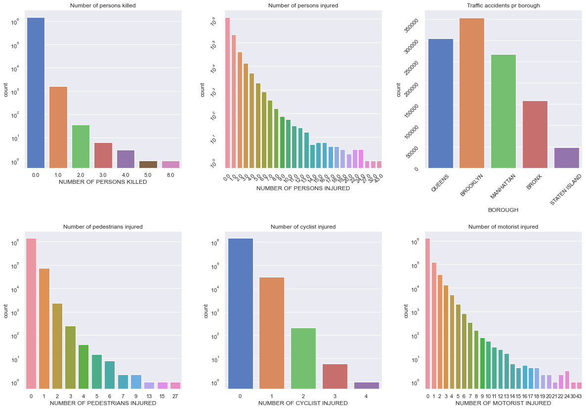
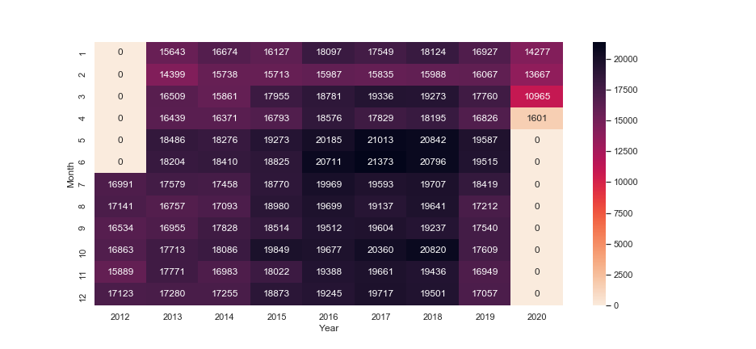
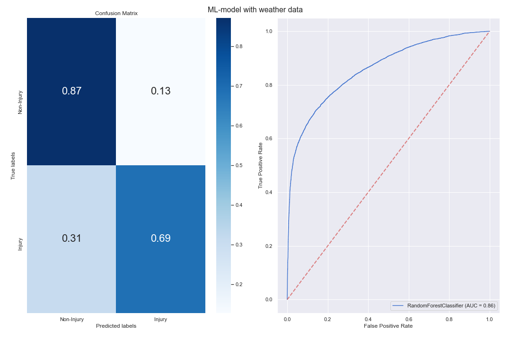
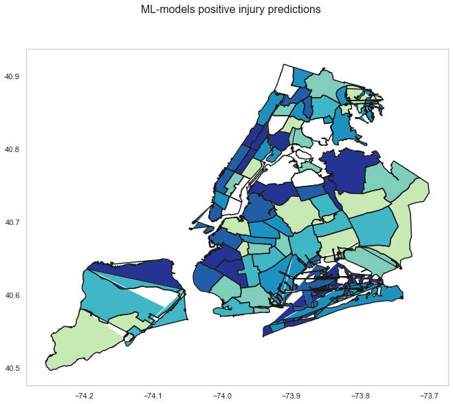

# NYC Vehicle Crashes 

Since 2012 more than 1,000,000 traffic accidents have occured in New York. 
As a result of those accidents around 200,000 people have gotten injured. 
In fact, traffic incidents are the leading cause of injuries in New York City INSERT CITATION HERE. 
The aim of this project is to visualize, analyze and model the traffic incidents in order to find identifiable patterns that could aid the process of reducing the risk of injuries in New York City. 
To enable this, the Motor Vehicle Collisions data sets from NYC database is used (the data can be found here: [Crash Data](https://data.cityofnewyork.us/Public-Safety/Motor-Vehicle-Collisions-Crashes/h9gi-nx95), [Vehicle Data](https://data.cityofnewyork.us/Public-Safety/Motor-Vehicle-Collisions-Vehicles/bm4k-52h4) and [Persons Data](https://data.cityofnewyork.us/Public-Safety/Motor-Vehicle-Collisions-Person/f55k-p6yu)).

More specifically, we ask the following questions; 

* Where and when are the crashes happening? 
    * Based on the different boroughs in NYC, the GPS locations, time and day of the crashes.
* What are the leading causes of these accidents?
    * Alcohol involvement and outside-of-the-car distractions are looked into.
* What vehicles are often involved?
    * A large number of vehicle types are reported in the crash data sets.
* Is it possible to model whether or not a trafic accident will result in an injury or not?

All vizualisations and modelling along with the code in this study can be found at INSERT REF EXP NOTEBOOK.

## New York through data
As mentioned, lots of car crashes happen every day in NYC. In fact, so many happen that we can visualize the entire city just based on the GPS location of the individual crashes when we sample over the 8-year span in which the data has been gathered (2012 - 2020). From the map below, we can recognize some of NYCs famous features such as Central Park in Manhattan (the black square in the left-most area) and the Hudson river which encircles the Manhattan peninsula. 

<iframe src="map.html"
    sandbox="allow-same-origin allow-scripts"
    width="100%"
    height="520"
    scrolling="no"
    seamless="seamless"
    frameborder="0">
</iframe>

By using the data freely available to us, we hope to broaden ours and your understanding of the city based solely on the car crash data sets. A big task, we know, but stay with us!

## Basic statistics 
The goal of the following visualizations is primarily to get you, the reader, up to speed on how the distribution of car crashes looks like in NYC. What is the maximum number of people killed in a single car crash? What is the maximum number injured? How do the different age groups fare in the statistics? Where do most of the car crashes happen? Lots of plots, but they contain some fascinating information!

### Injuries and distribution in the boroughs
Using the data sets, we have plotted the number of persons, pedestrians, cyclists and motorists injured along with the number of persons killed on a logarithmic plot. This gives us a feeling for how many crashes are severe in the sense that they inflict injuries or even deaths. Fortunately, most crashes across all the traffic groups are seen to be non-lethal and even non-harmful. But still, a significant number of them result in an injury, and a few of them even have multiple people injured. If we look at the last columns of the persons, pedestrians and motorist plots, we can see a few which have a lot of people involved in the crash (43 persons injured in the same car crash!).

Furthermore, the number of traffic accidents across the 5 boroughs in NYC are plotted in a bar plot, showing that Brooklyn has the highest number of car crashes when we count them up over the 8-year time span.

<iframe src="yearly_borough.html"
    sandbox="allow-same-origin allow-scripts"
    width="100%"
    height="325"
    scrolling="no"
    seamless="seamless"
    frameborder="0">
</iframe>

Building upon the crashes in the boroughs, we have plotted the yearly development for each borough, where the success in reducing the number of crashes for i.e. Manhattan over the years can be seen. This could be due to a program initialized in 2014 called 'Vision Zero', which was aimed at reducing the amount of injuries related to vehicle accidents. A link to the program can be found [here](https://www1.nyc.gov/content/visionzero/pages/). This program continues to this day, and employs increased traffic control (harder penalties for speeding, failing to yield to pedestrians etc.). As such, it wouldn't surprise us if this is the cause of this drop in injuries.

### Crash distribution heatmap
Next, we show a so called heat map, to get a feel for how the number of crashes vary over the months in a year for all the years in which the data has been gather. In the plot, month 1 is January and 12 is December.

The thing worth noticing here is the smaller amount of accidents early in the year and the increase in reported 
accidents from 2015 to 2018 (the increase in dark colors). The summer of 2016-2018 saw an increase of around
1500-2000 accidents compared to earlier years. It is difficult to predict what the main contributing factors were here. 
Our initial guess was that higher temperatures in this period could contribute to an increase in traffic. However,
according to the National Wheather Service, the summers of 2016-2018 in New York were not distinctly warmer than previous
years [Central Park annual temperatures](https://www.weather.gov/media/okx/Climate/CentralPark/monthlyannualtemp.pdf). In reference to the 'Vision Zero' program, another explanation could be that the program was not very successful, or that the program has increased general traffic awareness leading to an increase in reported/registered accidents corresponding to the effectiveness of the employment of the program.

### Borough maps 
Another interesting aspect of these reported injuries, is how the types of road users are involved in the crashes in the boroughs. We imagine that there could be some correlation between borough and whether the injured persons are pedestrians/cyclists/motorists. The visualizations below show injury percentages for different road users in each borough.    

<iframe src="inj.html"
    sandbox="allow-same-origin allow-scripts"
    width="50%"
	align = "left"
    height="400"
    scrolling="no"
    seamless="seamless"
    frameborder="0">
</iframe>

<iframe src="ped.html"
    sandbox="allow-same-origin allow-scripts"
    width="50%"
	align = "right"
    height="400"
    scrolling="no"
    seamless="seamless"
    frameborder="0">
</iframe>

<iframe src="cyc.html"
    sandbox="allow-same-origin allow-scripts"
    width="50%"
	align = "left"
    height="400"
    scrolling="no"
    seamless="seamless"
    frameborder="0">
</iframe>

<iframe src="mot.html"
    sandbox="allow-same-origin allow-scripts"
    width="50%"
	align = "right"
    height="400"
    scrolling="no"
    seamless="seamless"
    frameborder="0">
</iframe>

The topleft image shows similar information as the *Injuries by Year and Borough* plot above.
Brooklyn has the highest amount of injuries in this period. However, when looking at road users, Brooklyn is quite average. Further observations are:

* Manhatten has a high percentage of pedestrians and cyclists getting injured compared to other boroughs. 
* All boroughs have a high percentage of motorists getting injured, with manhatten the lowest of 40 %. Staten Island have a whole 82% of motorists getting injured! At the same time, scoring low percentages for pedestrians and cyclists.

## Age group and gender distribution
Now, we look into another part of the data set, namely the data about the people involved in the crash. We have chosen to look at the drivers of the vehicles involved in the crashes, more specifically their age and genders, to attempt to discern if there are any patterns. The drivers are split into age groups for each gender (male/female), which are then normalized by the actual number of people in NYC within that age group (specific numbers are found [here](https://www.baruch.cuny.edu/nycdata/population-geography/age_distribution.htm)). This gives us a realistic method of comparing the number of crashes per 1000 people now found in each bar to a bar in a different age group. However, as we don't know how many people in a given age group have a drivers license and own a vehicle, there's still some error here, but we have unfortunately not been able to find such numbers.

<iframe src="Crashes_agegroups.html"
    sandbox="allow-same-origin allow-scripts"
    width="100%"
    height="525"
    scrolling="no"
    seamless="seamless"
    frameborder="0">
</iframe>

We all know the prejudice about young males and fast cars, but there's actually something to it! We can see a large amount of the crashes has a male driver between the age of 20 and 24 involved in the crash, whereas the older males have a significantly lower amount of car crashes to their names. Funnily enough, we can see the same trend for young females! We can see that young males in this age group are involved in more than 3 times the amount of car crashes compared to their female counterparts, but when we look at the trend for females themselves, they also appear to be involved in more crashes when compared to their older age groups. As such, the same trend is visible for both males and females.

## Spatial distribution of the car crashes
Phew, that was a lot of static bar plots! I think it's time for some interactive plots. In the following map, we have plotted the individual crashes on a map, where each crash is categorized by where it happened, how many people got injured in the crash, why the crash happened and what kind of vehicle was involved. The color of the initial circles represents the density of crashes, with a number corresponding to the crashes in a given area.

<iframe src="interaktivfoliummap.html"
    sandbox="allow-same-origin allow-scripts"
	width="100%"
    height="600"
    scrolling="no"
    seamless="seamless"
    frameborder="0">
</iframe>

Have a look around, and try to see if you can spot some of the interesting cases we talked about earlier (Hint: the 43 persons injured crash happened on Herkimer Street in Brooklyn, which can be found west of the Cemetery of the Evergreens along Atlantic Avenue with a marker colored red).

### Dangerous roads
We now turn our attention to the roads in New York. It is expected that some roads are more prone to have accidents than others, due to factors like heavy traffic, poor road conditions, traffic nodes etc. The figure below shows the roads with the highest accident counts for each borough.

<iframe src="Dangerous.html"
    sandbox="allow-same-origin allow-scripts"
    width="100%"
    height="450"
    scrolling="no"
    seamless="seamless"
    frameborder="0">
</iframe>

For near all boroughs, there are one or two roads responsible for a large portion of the crashes. In Queens for example, **Northern Boulevard** and 
**Queens Boulevard** have around 100% and 50% more crashes than **Woodhaven Boulevard**. 
Unless the reader is very well versed in New Yorks street plan, the location and
names of these roads are likely unfamiliar. To better get a picture of the location and length of these roads,
the crashes for the top three dangerous roads in each borough in 2016 are visualized in two maps below. To open the map in a separate tab simply click [here](./roadmap.html). Try to click around, notice anything that seems odd?

<iframe src="roadmap.html"
    sandbox="allow-same-origin allow-scripts"
    width="100%"
    height="750"
    scrolling="no"
    seamless="seamless"
    frameborder="0">
</iframe>

For both the southern and northern boroughs the road outlines are clearly visible and the crashes are happening on almost all parts of the roads over the span of a year. Many locations also have more than one crash happen at the same coordinates. 
Especially cross-sections seem to be a hotspot for multiple crashes. Take for example the cross-section between **Northern Bouleward** and **Broadway** at (-73.90,40.75) where over 10 accidents happened in 2016. 

To some surprise, the map also shows a fair amount of outliers that reveal errors in the data. At (-73.87,40.67) in Queens there are three separate crashes having these coordinates, even though the roads are **Broadway** and **3 Avenue**  and the borough is Bronx. This is a good example of human error in the data and we can only guess what the reason behind this error is. Perhaps there is a police precinct at this location? Or maybe it is the home adress of people involved in the crash ? 
Unfortunately we will never know. The amount of these corrupted data points are low, which makes them reglible in the analysises containing these variables. 

## Temporal distributions of the car crashes
The final set of visualizations pertaining to the raw data are the temporal developments of causes of crashes and vehicle types involved. The data is sorted by the hour of the day, day of the week and months of the year, all separated into separate tabs. The contribution factors and vehicle types are selected by taking the top 14 and 11 causes of crashes, respectively. Click on the interactive legends to see how bar plots vary across hours, weeks and months.

<iframe src="Crashes_hours_weeks_months.html"
    sandbox="allow-same-origin allow-scripts"
    width="100%"
    height="1050"
    scrolling="no"
    seamless="seamless"
    frameborder="0">
</iframe>

**Our observations:**
* If we sort by hours of the day, most of the violations shows the rush hour traffic pattern very clearly. For instance, for 'Driver Inattention/Distraction' the number of crashes increases between 8-9 am (morning rush hour) then drops slightly before increasing again around 4-6 pm.
* In contrast, if we look at the hourly pattern from the 'Alcohol Involvement', the inverse pattern is seen where the week hours of the morning see the largest number of crashes (our guess is people driving home from a night out).
* We can also see that the weekly 'Alcohol Involvement' pattern sees an increase over the weekend in number of crashes, whereas 'Driver Inattention/Distraction' slightly drops over the weekend.
* Another interesting pattern is the crashes where a bicycle or a motorbike was involved. If we sort by months, we can see that this type of crash increases over the summer months (better weather means more people on bicycles/motorbikes).
* Furthermore, sorting by 'Bus' by weeks, we can see that most of the bus crashes are happening on workdays of the week, where an increased number of busses are sent in to accommodate the work-commuters.

### Summary of important data features
Now that we have seen a lot of plots of the data, and visualized it in a lot of different ways, we thought it a good idea to quickly summarize our findings and also discuss why we did the visualizations in the first place! As the aim was to visualize and model the trends in the data, we needed to filter the important features from the redundant.

Firstly, we saw a temporal dependency on some of the contributing factors and vehicle types on the number of crashes, indicating that i.e. alcohol involvement or bicycles were good features to look at when selecting important features for a model. Furthermore, we found that age had a very distinct impact on the number of crashes and finally that the number of crashes was very dependant on where in NYC you were looking, i.e. GPS coordinates or just the borough. 

To summarize, some of the variables seemed to be correlated with the number of crashes, which, combined with the assumption that a high number of crashes leads to a higher chance of an injury occurring, made the foundations of the predictive modelling to come.

## Machine learning 

We will now try to use all the information gathered in the previous sections to make a machine learning model for traffic injuries.  As mentioned, we have chosen to see if it’s possible to make a model that predicts whether an injury will occur in a traffic accident. Our hypothesis is that traffic injuries don’t arise in a purely stochastic manner, meaning that they're not random. It is believed their occurrence is influenced by a multitude of factors such as drivers’ physical conditions, car types, traffic condition and weather. This is based on all the interesting trends we have discovered so far. Such as the reckless young drivers, the dangerous roads and the time distributions of accidents. All these findings led us believe this model would be feasible. 

Enough small-talk, lets get to it! The model is attempting to predict whether an injury will occur, not the number of persons injured. As such, we have used the 'NUMBER OF PERSONS INJURED' column in the data, and binned all values above 1 to 1, thus turning it into a binary classification problem (injury or no injury). It was shown that boroughs, time, day of the week, age, contributing factors and vehicle type all influenced traffic incidents and injuries. We therefore chose to use these features in our model. In addition to these features, we also incorporated weather conditions such as temperature, humidity, wind speed and description of the weather e.g. rain, thunder, snow and sun. At first glance, the weather conditions did not show any interesting dependencies of traffic incidents and therefore have not been presented earlier. However, from our assumptions that there must be a dependency it was chosen to be incorporated in the machine learning model. 

### Predictive modelling
The model we achieved the best results with was the Random Forest classifier. To quickly summarize, the Random Forest classifier attempts to divide the data into reasonable sections using a decision tree, much like how a doctor would diagnose a disease to produce a prediction of a given class (here this would be either injury or non-injury). 

([source](https://medium.com/@williamkoehrsen/random-forest-simple-explanation-377895a60d2d))

The algorithm then performs this modelling sequence a number of times and then takes the average as the final model. With such a model, we achieved the following results. 

### Results

To evaluate the model performance, we look at two figures; the confusion matrix and the receiver operations characteristics curve (ROC). A confusion matrix is a table that is often used to describe the performance of a classification model. It allows for easy identification of confusion between the classes. In our case, we can see it predict 87% of its non-injury predictions correctly and 69% of its injury predictions correctly. In addition to this, from the ROC curve, the model can correctly distinguish between the binary classes 78% of the time. Overall the model performs surprisingly well considering the classification problem.

From the feature importance we can see which features the model find most important. You can hover over the graph below to find out. You will discover features such as person type, latitude, longitude and some of the weather features play an important role. 

<iframe src="ML_feature.html"
    sandbox="allow-same-origin allow-scripts"
    width="100%"
    height="325"
    scrolling="no"
    seamless="seamless"
    frameborder="0">
</iframe>

How the model uses the features to distinguish between the classes can be tough to figure out due to machine learning algorithms working like a black box. Instead we can try to figure out where in New York the model is most accurate and the best places for it to be implemented. In the choropleth map below a visual illustration of exactly this is shown. Here the colors indicating the percentual performance of the model in different New York communities. 

 

As we can see on the map the model is highly effective in some areas, this could be due to some of the dangerous intersections where the model can distinguish for injuries.  On top of that the model tells us an increased focus should be on bicycle safety since it has an high feature importance and fatigued drivers. 

## Final conclusions
Overall, we are quite satisfied with the model performance considering traffic injuries could be stochastic in nature. But we were able to capture some of the underlying structure of the data in the Random Forest classifier, enabling us to predict whether a crash would involve an injury or not with an overall accuracy of about 86%. So what can we use it for?
One approach to this, is to look at the features that the model thought more important, and buckle down on initiatives in line with what 'Vision Zero' has implemented over the years. But to increase efficiency, based on the map of NYC with the model predictions above, the city could focus its resources on areas where the likelihood of having an injury is higher. An example could be increasing safety measures for bus lanes, bicycle lanes etc. or to build pedestrian islands with a protective fence around it to reduce the chance of being hit by a car in which the driver was fatigued/drowsy (as this feature was highlighted by the model).

