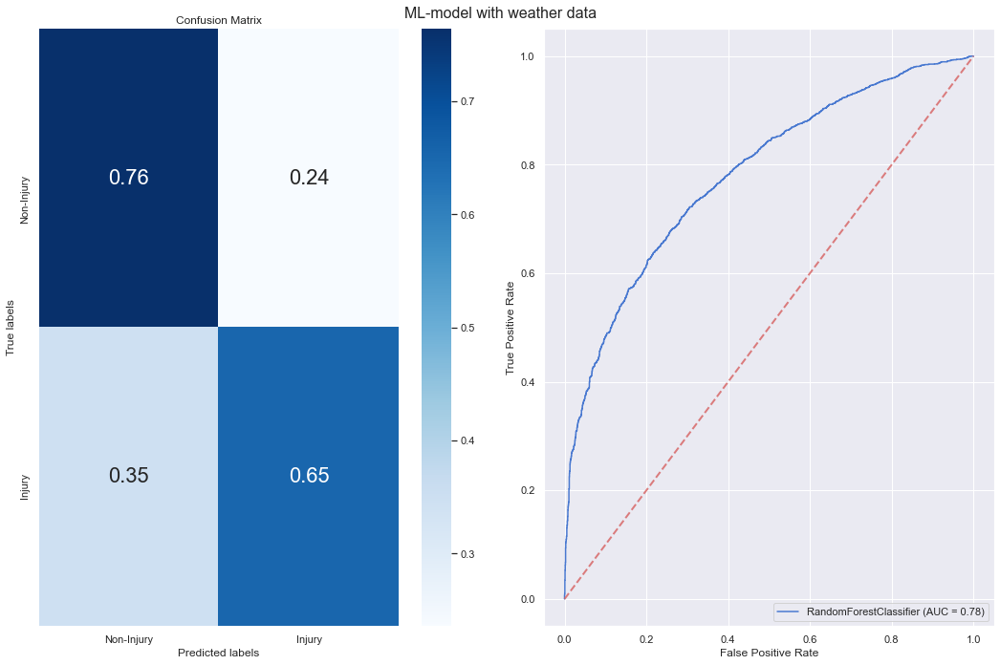
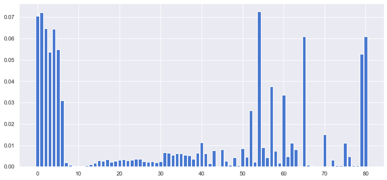

# NYC Vehicle crashes 

Since 2012 more than 1,000,000 traffic accidents have occured in New York.
As a result of those accidents around 200,000 people have gotten injured.
In fact, traffic incidents are the leading cause of injuries in New York City.
The aim of this project is to visualize, analyze and model the traffic incidents in order to find identifiable patterns that could aid the process of reducing the risk of injuries in New York City. 
The questions we will try to answer are; Where are the crashes happening? What are the leading causes of theese accidents and what vehicles are often involved?

Some more introduction here ?  

All vizualisations generated in this study can be found at INSERT REF EXP NOTEBOOK. 

## New York through data

Test text

<iframe src="map.html"
    sandbox="allow-same-origin allow-scripts"
    width="100%"
    height="600"
    scrolling="no"
    seamless="seamless"
    frameborder="0">
</iframe>

<iframe src="interaktivfoliummap.html"
    sandbox="allow-same-origin allow-scripts"
    width="100%"
    height="600"
    scrolling="no"
    seamless="seamless"
    frameborder="0">
</iframe>

Below we show a heatmap of the total distribution of crashes over the months for the period 2012-2019. 

The thing worth noticing here is the smaler amount of accidents early in the year and the increase in reported 
accidents from 2015 to 2018 (the increase in dark colors). The summer of 2016-2018 saw an increase of around
1500-2000 accidents compared to earlier years. It is dificult to predict what the main contributing factors were here. 
Our initial guess was that higher temperatures in this period could contribute to higher outside traffic. However,
according to the National Wheather Service, the summers of 2016-2018 in New York where not distinctly warmer than previous
years [Central Park annual temperatures](https://www.weather.gov/media/okx/Climate/CentralPark/monthlyannualtemp.pdf).
In 2014 New York initialized a 'Vision zero' program aimed at reducing the amount of injuries related to 
vehicle accidents [Vision zero](https://www1.nyc.gov/content/visionzero/pages/). 
This could either mean that the program was not very succesfull or that this program increased awareness around vehicle accidents leading to
more accidents beeing registered/reported without a significant change in actual accident numbers.

<iframe src="yearly_borough.html"
    sandbox="allow-same-origin allow-scripts"
    width="100%"
    height="500"
    scrolling="no"
    seamless="seamless"
    frameborder="0">
</iframe>

##

<iframe src="Crashes_agegroups.html"
    sandbox="allow-same-origin allow-scripts"
    width="100%"
    height="500"
    scrolling="no"
    seamless="seamless"
    frameborder="0">
</iframe>

## Dangerous roads

We now turn our attention to the roads in New York. It is expected that some roads are more prone to have accidents than others,
due to   

<iframe src="Dangerous.html"
    sandbox="allow-same-origin allow-scripts"
    width="100%"
    height="800"
    scrolling="no"
    seamless="seamless"
    frameborder="0">
</iframe>

[Map containing crashes at dangerous roads](./roadmap.html)

<iframe src="Crashes_hours_weeks_months.html"
    sandbox="allow-same-origin allow-scripts"
    width="100%"
    height="1600"
    scrolling="no"
    seamless="seamless"
    frameborder="0">
</iframe>

## Machine learning 
Traffic accident prediction is very difficult and requires non-accident data. It was therefore chosen to see if it was possible to predict whether an injury will occur in a traffic accident. Our hypothesis is that traffic injuries don't arise in a purely stochastic manner. It is believed their occurence is influenced by a multitude of factors such as drivers' physical conditions, car types, traffic condition and weather. 
In this section we will therefore investigate the possibility of predicting whether or not a traffic incident will involve an injury.

To do this two different machine learning models are used and tested on different feature sets. We are predicting on the "NUMBER OF INJURY" column and have transformed the column into a binary variable by combining all injuries over 0 to 1. Therefore it has been made into a binary classification problem. 

bla bla bla something with weather model and it didnt predict better
##

